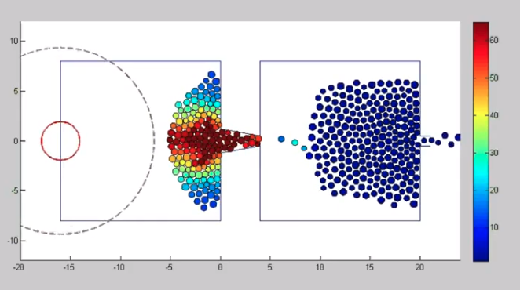

# Term Proposal - Crowd Evacuation Simulation

## Table of Contents

 - [Motivation](#motivation)
 - [Ideas](#ideas)
 - [To-Do List](#to-do-list)
 - [Example](#example)
 - [Reference](#reference)

## Motivation

People often fall into **panic** when they meet dangers like fire or earthquake. Losing the ability to thinking and acting calmly make them lose the opportunity of being out of danger. If we can **simulate the situation** that crowd evacuate from indoor to outdoor when breaking out of the fire, then we can schedule the escape route more smoothly to prevent disaster.

## Ideas

### Behaviors of Human
 - Simulate the **flocking behavior** of humans.
 - Simulate the **herd behavior** of humans.
 - Simulate the **panic behavior** of humans when encountering dangers.
 - All behaviors listed above are factors that will affect people's actions. Each factor will be assigned a **floating weight** so that each factor will have different influences under different situations.

### Targets of Program
 - **Simulate and visualize** the situation that crowd evacuate from indoor to outdoor.
 - Take **human behaviors** into consideration to determine crowd's action.
 - Let user **design** the indoor traffic flow.
 - Calculate the amount of time that people evacuate from indoor to outdoor.
 - Calculate the number of people that die in the fire. 
 - Store the **best** traffic flow.

## To-Do List

 - [x] Find Term Project topic. ( 1 week )
 - [x] Collect information on that topic. ( 1-2 weeks )
 - [x] Determine the targets of the project. ( 1 week )
 - [ ] Plan and build the project structure. ( 1-2 week )
 - [ ] Coding and debugging. ( 4-6 weeks )
 - [ ] Refine features and codes. ( 1-2 weeks ) 
 - [ ] Prepare the presentation. ( 1 week )

## Example

Crowd evacuation simulation example. Each dot represents a person, the circle on the left side represents danger, the color on each dot means the panic degree.

## Reference

 - [Evacuation simulation](https://en.wikipedia.org/wiki/Evacuation_simulation)
 - [Flocking (behavior)](https://en.wikipedia.org/wiki/Flocking_(behavior))
 - [Boid](https://en.wikipedia.org/wiki/Boids)
 - [Herd behavior](https://en.wikipedia.org/wiki/Herd_behavior)
 - [Crowd modeling and simulation with contagious panic: Panic evacuation](https://www.youtube.com/watch?v=SCm0mKPdY3M)
 - [Dynamic Interactive Crowd Simulation using Stress Based Behavior](https://users.csc.calpoly.edu/~zwood/teaching/csc572/final17/smseiber/index.html?fbclid=IwAR2Cw7XXhafc5HrfROChYzjc39_VEAKA8xG15sW2Z7h3ppjmdehuKV9K_6I)
 - [Crowd dynamics experiment: Exit choice in an evacuation](https://www.youtube.com/watch?v=cGJ0NT_Bg4g)
 - [Social Force Model for Pedestrian Dynamics](https://arxiv.org/abs/cond-mat/9805244)
 - [Crowd Simulation Modeling Applied to Emergency and Evacuation Simulations using Multi-Agent Systems](https://arxiv.org/pdf/1303.4692)