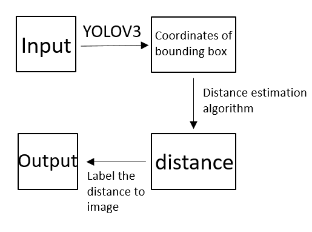

# 19Fall NSD Term Project Proposal - Single Camera Distance Estimation

## Introduction

Distance estimation is an important feature for robotic tasks such as obstacle detection. A distance estimate device typically consists of one or a pair of cameras. There are two approaches for distance computation which are monovision and stereovision.

Sterovision is the extraction of 3D information from digital images which has high accurate at estimation. However, it requires at least two cameras to obtain the 3D information. Moreover, it needs more computation time than single camera beacuse it uses a complex algorithm.

On the other hand, monovision which requires only one camera needs less computation time but has less accurate.

Since monovision approach needs only one sensor, I decided to implement a distance estimation algorithm using single camera in this term project.

## ToDo

* Functions which are implement the distance estimation algorithm use [Triangulariztion Method](http://www.cmlab.csie.ntu.edu.tw/~zenic/Data/Download/ICME2012/Workshops/data/4729a511.pdf) in C++.
* Use [YOLOV3](https://github.com/pjreddie/darknet) which is a powerful object detection model to obtain the bounding boxes of objects.
* Wrap the algorithm and YOLOV3 up to estimate the final results.
* Also, I will bin the distance estimation algorithm with pybind11 and wrap it up with [YOLOV3 Python version](https://github.com/ultralytics/yolov3), so that I can deploy it on both C++ and Python platform.
* Test the result with ground truth. Hope the error is within 10%.
* The approaches will be like:

## Implementation

Input data will be a image, a video or using webcam. Parameters of the camera are also needed which are height, vertical angle of the camera and field of view angles.

Output data will label the bounding boxes, names and distances of detected objects and save as a image ,a video or a realtime stream. 

## References

* [Triangulariztion Method](http://www.cmlab.csie.ntu.edu.tw/~zenic/Data/Download/ICME2012/Workshops/data/4729a511.pdf)
* [YOLOV3 C++](https://github.com/pjreddie/darknet)
* [YOLOV3 Python](https://github.com/ultralytics/yolov3)
