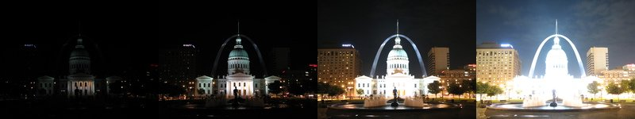

# High Dynamic Range Imaging using Multiple Exposure Images with Tone Mapping

## Motivation
The real world is high dynamic range, but the camera is limited dynamic range. In case to get the image that looks more like the real world image, high dynamic range imaging (HDRI) is invented.

HDRI is widely used in the imaging and photography industry, such as the APPLE iPhone's camera also use this to get a better image.

## Target
I have read some tutorial to teach people how to implement the HDRI algorithm, but most of the function is provided by the OpenCV library.

I know the library is powerful, but I think if I can do it on my own, I will learn the details and understand what it works. Moreover, I want to design the architecture like moving the time-consuming computation into c++, creating a user interface that users can easily use this program, and then merge it together.

## Implement

### 1. Upload several images with different exposures 
=> implement user interface

### 2. Align Images
To prevent ghosting artifacts, we need to align these images.

=> implement alignMTB function

### 3. Estimated the Camera Response Function
By using CRF(Camera Response Function) recovery algorithm, we can estimate the CRF from these images by removing the "bad" pixels (too dark or too bright ), and averaging the remaining "good" pixels base on the exposure time.

=> implement calibrateDebevec(CRF in OpenCV) 

### 4. Merge Images together
Once the CRF has been estimated, we can merge the exposure images into one HDR image.

=> implement MergeDebevec(merge in OpenCV) 

### 5.Tone mapping
Converting a High Dynamic Range (HDR) image to a 24-bit image while preserving as much detail as possible for display purposes. There are many methods that provide tone mapping, I decide to implement one or two method depend on the time.
These methods also have some parameters that can adjust, so we need to find the best parameters combination.

=> implement TonemapDrago

=> implement TonemapReinhard

=> find the best parameters combination

## Unittest
- test the function correctness
- test the user interface 

## Todo List
* [x] find topic
* [ ] paper reading and understand the background
* [ ] write code and debug
    * [ ] user interface
    * [ ] alignMTB function
    * [ ] calibrateDebevec(CRF in OpenCV) 
    * [ ] MergeDebevec(merge in OpenCV) 
    * [ ] TonemapDrago
    * [ ] TonemapReinhard
* [ ] testing
    * [ ] user interface
    * [ ] alignMTB function
    * [ ] calibrateDebevec(CRF in OpenCV) 
    * [ ] MergeDebevec(merge in OpenCV) 
    * [ ] TonemapDrago
    * [ ] TonemapReinhard
* [ ] find the best parameters combination
* [ ] testing the program

## Reference
[HDRI slide @ ntu](https://www.csie.ntu.edu.tw/~cyy/courses/vfx/10spring/lectures/handouts/lec03_hdr.pdf)

[HDRI implement with OpenCV lib](https://www.learnopencv.com/high-dynamic-range-hdr-imaging-using-opencv-cpp-python/)

[HDRI wikipedia](https://en.wikipedia.org/wiki/High-dynamic-range_imaging)

[OpenCV lib](https://github.com/opencv/opencv)

[CRF recovery algorithm](http://www.pauldebevec.com/Research/HDR/debevec-siggraph97.pdf)

[Tonemap Drago](http://resources.mpi-inf.mpg.de/tmo/logmap/logmap.pdf)

[Tonemap Reinhard](http://erikreinhard.com/papers/tvcg2005.pdf)

