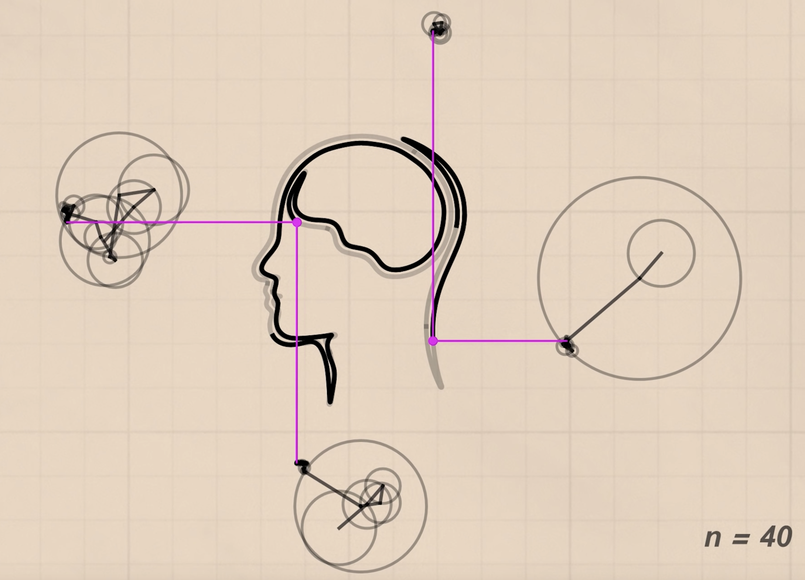

# Fourier Plotter

### Background

Fourier Analysis is used to approximate a function by sums of weighted sine or cosine functions.
Since every stroke on an x-y plane could be seen as two functions ( x(t), y(t) ) combined, which is x-time, and y-time, we can approximate every stroke on a plane using Fourier series by tracing every stroke on it.

### Motivation

When I was watching a video on youtube ([What is a Fourier Series by Smarter Everyday](https://www.youtube.com/watch?v=ds0cmAV-Yek)) in 2018, I was stunned seeing that they draw their logo by using Fourier series.

Although the underlying concept is easy, this picture truly enlightens me about the beauty of math.

### Project description

I want to build a Fourier plotter. Which would approximate user's strokes interactively.
Besides, I want this program reachable to every user, so the frontend of the project should be a browser.

In other word, the specification of this project is :

+ Input:
    A sketchpad which allows users to draw their pictures.
+ Output:
    Multiple pens constructed by Fourier Series approximate user's input by drawing simultaneously.

### Implemenatation

There is an existing [FourierGL](https://github.com/bonafid3/FourierGL) which uses QT and C++.
However, my ultimate goal is to build it with naive javascript with little efficiency loss.
I would first search for some implementations online and rebuild those wheels myself (using naive javascript). After that, if the efficiency isn't acceptable, I would probably search for Web assembly (compile from C++), GPU.js, or furthermore, a node backend which uses C++ library to speed up my program.

### Miletones

+ Understand the concept of Fourier Transformation (FFT)
+ Implement an API for Fourier Analysis (or find an existing one)
+ Implement the frontend (the sketchpad) of the website
+ Speed up the code by various approach if needed (definitely)

### Resources

+ Implemenatations
  + [FourierGL](https://github.com/bonafid3/FourierGL)
  + [Epicycles, complex Fourier series and Homer Simpson's orbit](https://www.youtube.com/watch?v=qS4H6PEcCCA)
+ Concepts about complex fourier series
  + [What is a Fourier Series? (Explained by drawing circles) - Smarter Every Day 205](https://www.youtube.com/watch?v=ds0cmAV-Yek)
  + [Epicycles, complex Fourier series and Homer Simpson's orbit](https://www.youtube.com/watch?v=qS4H6PEcCCA)
  + [Fuyye Series and Making Sound from Video](http://bilimneguzellan.net/fuyye-serisi/)

+ JS plotting library
  + [P5.js](https://p5js.org/)
+ [C/C++ to wasm](https://developer.mozilla.org/en-US/docs/WebAssembly/C_to_wasm)
+ [Node.js C++ addons](https://nodejs.org/api/addons.html)