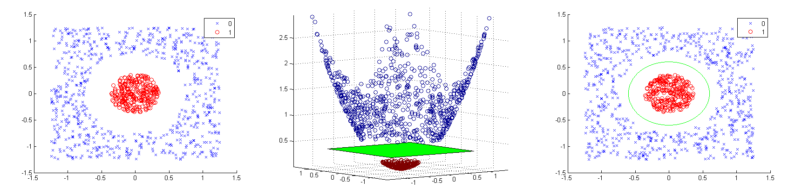

# SVM implementation

## Introduction

SVMs (support-vector machines) are supervised learning methods proposed by Vapnik based on statistical learning theory for classification and regression analysis. SVMs have advantages in solving small sample, nonlinear and high dimensional mode discrimination problems.

Take the following figure as an example, in the 2 dimension case, SVMs find a line (hyperplan in higher dimension) to separate the blue and green dots, and maximize the distances between the line and the margins of the two class dots.

For nonlinear case, SVM do a kernel trick on the data. By applying the kernel to the data, SVMs can efficiently perform a non-linear classification in high-dimensional feature spaces.

## Motivation

I have taken a class about web search and mining, and I learned some SVM concepts from it. The professor also introduce the widely used implementation -- [libsvm](https://www.csie.ntu.edu.tw/~cjlin/libsvm/). the whole implementation code is small and refined (about 4,000 lines), so I will refer the papers and the project to reimplementat the most functionality libsvm has provided to have a deeper understand of the algorithm. Besides implementation, according the [FAQ](https://www.csie.ntu.edu.tw/~cjlin/libsvm/faq.html), for the parallel execution, the maintainer give the recommendation code for OpenMP on the bottleneck (but the code is not included in the source code). For this part, I'd like to do other apporaches to parallelize and optimize the code to get better performance.

## Approaches

I will implementat SVM in C++11, and optimize the code with different apporaches, such as OpenMP, SIMD, loop tilig. For different version of apporaches, I will also provide make rules for building different executables. Besides implementation, some unit tests for the functions will be included in the project. Some python bindings written in pybind11 will also be provided as the interface. In the end, I will take some benchmarks to compare the implementations.

## Reference

- [libsvm on GitHub](https://github.com/cjlin1/libsvm)
- [libsvm project page](https://www.csie.ntu.edu.tw/~cjlin/libsvm/)
- [SVM introduce on wiki](https://en.wikipedia.org/wiki/Support-vector_machine)
- [SVM introduction in Chinese](http://www.cmlab.csie.ntu.edu.tw/~cyy/learning/tutorials/SVM2.pdf)

