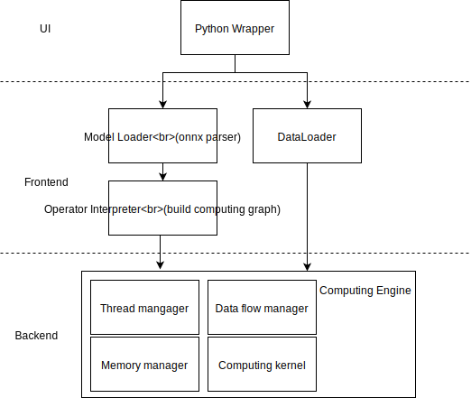

# INT8 Inference Engine for Neural NetWork
## Introduction
Neural network models are commonly trained using FP32. After training, models can be quantized into INT8 with little accuracy drop. 

Comparing to FP32 model, INT8 model has 4x memory reduction.
Also, it can be accelerate through SIMD instructions.

So, it's great for heterogeneous computing devices(asic, gpu and cpu) or some embeded devices(only cpu).
## Current Status
Intel and Arm both open source their own neural network library [mkl-dnn](https://github.com/intel/mkl-dnn) and [cmsis-nn](https://github.com/ARM-software/CMSIS_5/tree/develop/CMSIS/NN) with INT8 support.

Arm even provide a [paper](https://arxiv.org/abs/1801.06601) about the implementation.

Pytorch also provide a [quantization library](https://pytorch.org/docs/stable/quantization.html) to quantize a trained model to a compact one.
Currently, it already supports intel CPUs with AVX2 support.

## Target
Quantized models from pytorch would be export to onnx format.

So, I only need to implement 2 things which is the frontend and backend of my inference engine.

Also, I'll provide a python interface for ease of use.

### 1. The interpreter for onnx operators
onnx define a lot of operators for neural network model such as conv and maxpool.
I need to parse the data, according to the parameters to build the corresponding model and pass it to my backend system.
### 2. The computing runtime.
In the computing stage, the runtime need to manage memory, data flow and multi-threading.
It should maximize the use of SIMD to speed up, and minimize the memory footprint.

## Implementation

The prototype will at least support mnist dataset on AlexNet.

To support more operator and dataset, I'll define a generic abstract layer for them.
User could define their own operator and dataset through inheritance

Below is the architecture of the project.



## Testing
To ensure the correctness of this engine, I'll mainly test on 2 things.
1. Test each operator's correctness with unittest.
2. Feed in mnist dataset to see if there is a strange accuracy drop.

## Evaluation
I'll benchmark my inference engine through the below form.

I hope the result could be better than the plain FP32 pytorch model.

|Batch size|Pytorch FP32|Pytorch INT8|Gains|My Engine INT8|Gains|
|---|---|---|---|---|---|
|1|
|32|

## How to use the engine
This is a possible use case of the engine.

```python
import MyEngine
import time

model = MyEngine.load_onnx_model('mnist_alex.onnx')
test_loader = MyEngine.load_mnist(batch_size = 32)
t = time.time()
for data, label in test_loader:
  output = model(data)
  predict = output.argmax(axis=1)
  correct += (predict==label).sum()
  
print('Accuracy:', correct / test_loader.size)
print('Time elapsed:', time.time() - t)
```
